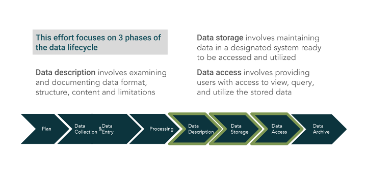
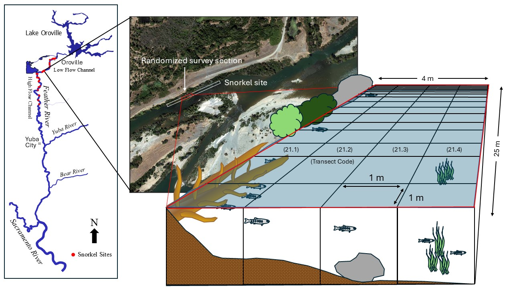

This project, through the Healthy Rivers and Landscapes Program, showcases Findable,
Accessible, Interoperable, and Reusable (FAIR) data principles ([Wilkinson et al. 2016](https://www.nature.com/articles/sdata201618)). We focus on three phases of
the data lifecycle: data description, storage and access (Figure 1, below).

## Data Summary

- **Who:** California Department of Water Resources (DWR), Ryon Kurth
- **What:** Snorkel surveys of microhabitat (1m x 1m units) and fish observations
- **When:** March-August 2001-2002
- **Where:** Feather River
- **Why:** This study was used in the Oroville Facilities FERC Relicensing

## Methods

In 2001 and 2002, the California Department of Water Resources (DWR) conducted snorkel surveys between March and August at 29 sampling locations in the Feather River (13 in the Low Flow Channel, 16 in the High Flow Channel). Each survey location covered an area of 25 meters long and four meters wide and ran parallel to one riverbank. Two divers surveyed the reach by swimming upstream and marking the location of fish observations and the number, species and size of the fish observed. The divers would then measure water depth, average velocity, substrate, cover, and habitat types at 36 points (e.g. the microhabitat unit), each representing one square meter within the reach. The divers also returned to the locations where fish were observed and measured depth and focal velocity associated with each fish observation. Water temperature was continuously monitored through a network of StowAway electronic thermistors. 

## Relevant Data Definitions

Complete metadata are available on the [Environmental Data Initiative](https://portal.edirepository.org/nis/mapbrowse?packageid=edi.1705.3). Below are data definitions relevant to this dashboard.

- **Location** refers to the area in the river that was snorkeled. There are 29 sampling locations. This is the most coarse spatial category.
- **Location Table ID** refers to the specific section within the location that was snorkeled representing 25 meters by 4 meters. Each location was surveyed once a month during the survey and the specific section was chosen at random and may or may not be the same between months. 
- **Transect Code** refers to the 1m by 1m microhabit unit within the survey section (e.g. location table ID). For each survey section there are 36 microhabitat units where the lowest ID numbers mean upstream and the highest mean downstream.
- **Cover categories** used in this dashboard include aquatic vegetation (submerged), boulder (greater than 300m substrate), cobble (150-300mm substrate), overhanging vegetation, undercut bank, and woody debris. The overhanging vegetation category combines the half meter and more than half meter overhead vegetation categories that were included in this data collection effort. The woody debris category combines the large (generally considered to be more than 10 cm at breast height and consists of tree trunks or a large branch) and small (generally considered to be less than 10 cm diameter at breast height) woody debris categories that were included in this data collection effort. There are additional categories included in the data collection effort but were not included here (fine, sand, small gravel, large gravel substrate).

## Resources for Data Use

- Data and metadata were prepared for publication and all code is published on [GitHub](https://github.com/Healthy-Rivers-and-Landscapes-Science/feather-river/tree/main/edi-mini-snorkel).
- Data and metadata are published on the [Environmental Data Initiative (EDI)](https://portal.edirepository.org/nis/mapbrowse?packageid=edi.1705.2) in csv format. These data can be downloaded directly from the EDI Data Portal or via an API.
- All code associated with this dashboard is published on [GitHub](https://github.com/Healthy-Rivers-and-Landscapes-Science/feather-river/tree/add-shiny-app/mini-snorkel-app). Note to update link when this is merged to main.
