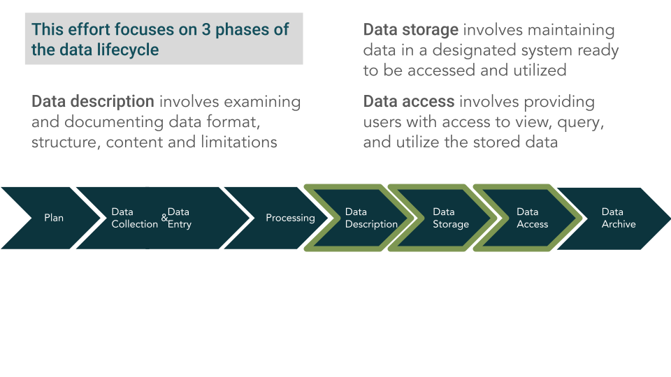

```{r global, include=FALSE}
library(tidyverse)
library(leaflet)

colors_full <-  c("#9A8822", "#F5CDB4", "#F8AFA8", "#FDDDA0", "#74A089", #Royal 2
                  "#899DA4", "#C93312", "#DC863B", # royal 1 (- 3)
                  "#F1BB7B", "#FD6467", "#5B1A18", "#D67236",# Grand Budapest 1 (-4)
                  "#D8B70A", "#02401B", "#A2A475", # Cavalcanti 1
                  "#E6A0C4", "#C6CDF7", "#D8A499", "#7294D4", #Grand Budapest 2
                  "#9986A5", "#EAD3BF", "#AA9486", "#B6854D", "#798E87", # Isle of dogs 2 altered slightly
                  "#F3DF6C", "#CEAB07", "#D5D5D3", "#24281A", # Moonriese 1, 
                  "#798E87", "#C27D38", "#CCC591", "#29211F", # moonrise 2
                  "#85D4E3", "#F4B5BD", "#9C964A", "#CDC08C", "#FAD77B" ) # moonrise 3 

fish_pres_cols <- c('Yes' = "#E6A0C4", 'No' = "#D5D5D3")

colfunc <- colorRampPalette(c("#02401B", "white"))
gradient <- colfunc(100)

mini_locations_raw <- read_csv("mini_locations_raw.csv")
mini_fish_raw <- read_csv("mini_fish_raw.csv")
# orders locations from upstream to downstream. 
# TODO we are missing coordinates for some locations
location_order <- tibble(location = c("hatchery ditch", "hour bars", "hatchery riffle", "trailer park", 
                                      "bedrock riffle", "steep riffle", "robinson riffle", "upper big hole", 
                                      "lower big hole", "g95", "gridley riffle", "big bar", "goose riffle", 
                                      "macfarland riffle", "shallow riffle", "herringer riffle", "junkyard riffle", 
                                      "auditorium riffle", "eye side channel", "matthews riffle", "eye riffle", 
                                      "lower hour", "aleck riffle", "weir riffle", "vance avenue", 
                                      "big hole", "hour riffle", "cox riffle", "gateway riffle"),
                         order = c(2,19,1,5,
                                   4,9,8,15,
                                   16,17,23,21,20,
                                   22,25,26,24,
                                   3,11,6,12,
                                   18,7,10,13,
                                   14,NA,NA,NA))

feather_cover <- mini_fish_raw |> 
  left_join(mini_locations_raw |> 
              distinct(location_table_id, date, channel_location, location)) |> 
  # create cover variables that are more consistent with strategic plan categories
  mutate(woody_debris = percent_small_woody_cover_inchannel + percent_large_woody_cover_inchannel,
         boulder = percent_boulder_substrate,
         cobble = percent_cobble_substrate, 
         undercut_bank = percent_undercut_bank, 
         aquatic_veg = percent_submerged_aquatic_veg_inchannel, 
         overhanging_veg = percent_cover_half_meter_overhead + percent_cover_more_than_half_meter_overhead) |> 
  select(micro_hab_data_tbl_id, location_table_id, transect_code, location,
         woody_debris:overhanging_veg, count, date) |>
  pivot_longer(cols = c(woody_debris, boulder, cobble, undercut_bank, aquatic_veg, overhanging_veg), names_to = "cover_type", 
               values_to = "percent_cover") |>  
  distinct() |> 
  left_join(location_order) |> 
  mutate(fish_presence = ifelse(count > 0, "Yes", "No")) |> select(-count) |> 
  mutate(location_table_id = paste0(date, " (location id: ", location_table_id, ")")) |> glimpse()

summary_cover <- feather_cover |> 
  group_by(location, cover_type, order, fish_presence) |> 
  summarize(percent_cover = mean(percent_cover)) |> 
  mutate(percent_cover = ifelse(is.na(percent_cover), 0, percent_cover))

# added distinct statement because there seem to be duplicates in the location table (we should fix this on EDI)

# TODO - The color setting isn't quite working
locations_sf <- sf::st_as_sf(mini_locations_raw |> 
                               distinct(location_table_id, date, channel_location, .keep_all = T) |> 
                               na.omit(), coords = c('longitude', 'latitude')) |> 
  select(location_table_id, location, channel_type, date) |> 
  mutate(location_table_id = paste0(date, " (location id: ", location_table_id, ")")) |> 
  mutate(color = colors_full[match(location, location)]) 
# group_by(geometry, location, channel_type, color) |> 
# summarise(location_table_id = paste0(unique(location_table_id), collapse = "; ")) |> glimpse()

```

```{r}
filtered_location_id <- reactiveValues(
  selected_points = NULL,
  filtered_data = feather_cover
)
```

About the Data
========================================================================

Column
------------------------------------------------------------------------

This project, through the Healthy Rivers and Landscapes Program, showcases Findable,
Accessible, Interoperable, and Reusable (FAIR) data principles ([Wilkinson et al. 2016](https://www.nature.com/articles/sdata201618)). We focus on three phases of
the data lifecycle: data description, storage and access (Figure 1, below).

```{r picture, echo = F, fig.cap = "Figure 1. Diagram of the data lifecycle highlighting the focus areas of this project", out.width = '50%', align = "center"}

```

**Data Summary**

- **Who:** California Department of Water Resources (DWR), Ryon Kurth
- **What:** Snorkel surveys of microhabitat (1m x 1m units) and fish observations
- **When:** March-August 2001-2002
- **Where:** Feather River
- **Why:** This study was used in the Oroville Facilities FERC Relicensing

**Methods**

In 2001 and 2002, the California Department of Water Resources (DWR) conducted snorkel surveys between March and August at 29 sampling locations in the Feather River (13 in the Low Flow Channel, 16 in the High Flow Channel). Each survey location covered an area of 25 meters long and four meters wide and ran parallel to one riverbank. Two divers surveyed the reach by swimming upstream and marking the location of fish observations and the number, species and size of the fish observed. The divers would then measure water depth, average velocity, substrate, cover, and habitat types at 36 points (e.g. the microhabitat unit), each representing one square meter within the reach. The divers also returned to the locations where fish were observed and measured depth and focal velocity associated with each fish observation. Water temperature was continuously monitored through a network of StowAway electronic thermistors. 

Insert diagram of methods.

**Relevant Data Definitions**

Complete metadata are available on the [Environmental Data Initiative](https://portal.edirepository.org/nis/mapbrowse?packageid=edi.1705.3). Below are data definitions relevant to this dashboard.

- **Location** refers to the area in the river that was snorkeled. There are 29 sampling locations. This is the most coarse spatial category.
- **Location Table ID** refers to the specific section within the location that was snorkeled representing 25 meters by 4 meters. Each location was surveyed once a month during the survey and the specific section was chosen at random and may or may not be the same between months. 
- **Transect Code** refers to the 1m by 1m microhabit unit within the survey section (e.g. location table ID). For each survey section there are 36 microhabitat units where the lowest ID numbers mean upstream and the highest mean downstream.

**Resources for Data Use**

- Data and metadata were prepared for publication and all code is published on [GitHub](https://github.com/Healthy-Rivers-and-Landscapes-Science/feather-river/tree/main/edi-mini-snorkel).
- Data and metadata are published on the [Environmental Data Initiative (EDI)](https://portal.edirepository.org/nis/mapbrowse?packageid=edi.1705.2) in csv format. These data can be downloaded directly from the EDI Data Portal or via an API.
- All code associated with this dashboard is published on [GitHub](https://github.com/Healthy-Rivers-and-Landscapes-Science/feather-river/tree/add-shiny-app/mini-snorkel-app). Note to update link when this is merged to main.


Habitat Summary
========================================================================

Column
------------------------------------------------------------------------

### Feather River locations are ordered from most upstream (closed to Oroville Dam) to the most downstream. Percent cover is averaged across all microhabitat plots within each location. See the Map Filter or Attribute Filter for more detailed summaries of habitat by microhabitat.

```{r, fig.width=11}
summary_cover |> 
  filter(!is.na(order)) |> 
  group_by(cover_type) |> 
  arrange(desc(order)) |> 
  mutate(location = factor(location, levels=unique(location), ordered = T)) |> 
  ggplot(aes(x = cover_type, y = location, fill = percent_cover)) + 
  #scale_y_reverse() +
  geom_tile(color = "white") + 
  scale_fill_gradient(low = "#D5D5D3", high = "#02401B", name = "Mean Percent Cover") +
  labs(
    x = "",   
    y = ""                     
  ) +
  theme_minimal() +
  theme(
    axis.title = element_text(size = 16),
    axis.text = element_text(size = 10, face = "bold"),
    legend.title = element_text(size = 14, face = "bold"),
    legend.text = element_text(size = 10, face = "bold"),
    legend.position = "top"
  )
```


Filter and View Data {data-orientation=rows}
========================================================================

There are two possible ways to filter the data: 1) `Attribute Filter` will allow user to filter by a specific location and sampling date; 2) `Map Filter` allows user to select a point on the map to view the the associated heatmap. Each option displays a heatmap of percent cover by type for each microhabitat unit. When a fish was present during the sampling, it is shown in a dark red outline. 


Row {data-height=100}
------------------------------------------------------------------------

```{r}
radioButtons("which_view", tags$strong("Choose how to filter the data:"), choices = c("Attribute Filter", "Map Filter"),
             selected = "Attribute Filter")

```

```{r}
conditionalPanel(
  condition = "input.which_view == 'Attribute Filter'",
  div(
    style = "display: flex; align-items: flex-start; gap: 10px;", # Flexbox for horizontal layout
    selectInput(
      "location_filter",
      label = tags$strong("Filter by Location:"),
      choices = c("all locations", unique(locations_sf$location)),
      selected = "all locations"
    ),
    output$location_id_ui <- renderUI({
      selectInput("location_id", label = tags$strong("Filter by Location Table Id:"),
                  choices = c("", filtered_location_id()), selected = "-")
    })
  )
)

```

Row
------------------------------------------------------------------------

### Habitat Map

```{r}

output$map <- renderLeaflet({
  leaflet(locations_sf) |>
    addProviderTiles(providers$Esri.WorldImagery, group = "Aerial Imagery") |>
    addProviderTiles(providers$OpenStreetMap, group = "Street Map") |>
    addCircleMarkers(layerId = ~location_table_id,
                     color = ~color,
                     radius = 6,
                     fill = TRUE,
                     fillOpacity = 0.2,
                     opacity = 0.6,
                     popup = paste0("Location Name: ", locations_sf$location,
                                    "<br>",
                                    "Location ID: ", locations_sf$location_table_id,
                                    "<br>",
                                    "Channel Type: ", locations_sf$channel_type)) |>
    addLayersControl(
      baseGroups = c("Aerial Imagery", "Street Map"),
      options = layersControlOptions(collapsed = FALSE)
    )
})

leafletOutput("map")

observeEvent(c(input$location_filter, input$location_id), {
  req(input$which_view == "Attribute Filter")
  
  req(input$location_filter, input$location_id)
  
  if (input$location_filter != "all locations" && input$location_id != "" && input$location_id != "-") {
    
    selected_location <- locations_sf |>
      filter(location == input$location_filter) |>
      group_by(geometry, location, channel_type, color) |>
      summarise(location_table_id = paste0(unique(location_table_id), collapse = "; ")) |>
      ungroup() |>
      filter(str_detect(location_table_id, paste0("\\b", input$location_id, "\\b")))
    
    if (nrow(selected_location) > 0) {
      
      coords <- sf::st_coordinates(selected_location)
      
      leafletProxy("map") |>
        setView(
          lng = coords[1],
          lat = coords[2],
          zoom = 15
        ) |>
        clearGroup("highlighted") |>
        addCircleMarkers(
          data = selected_location,
          lng = coords[1],
          lat = coords[2],
          fillOpacity = 0.2,
          opacity = 0.6,
          fill = TRUE,
          radius = 6,
          stroke = TRUE,
          weight = 4,
          popup = paste0("Location Name: ", selected_location$location,
                         "<br>",
                         "Location ID: ", selected_location$location_table_id,
                         "<br>",
                         "Channel Type: ", selected_location$channel_type),
          group = "highlighted"
        )
    }
  }
  
})


```


### Heat Map


```{r}
output$attribute_plot <- renderPlot({
  req(input$which_view == "Attribute Filter")
  
  if (input$location_filter != "all locations" && input$location_id != "" && input$location_id != "-") {
    
    filter_feather_cover <- feather_cover |>
      filter(location_table_id  == input$location_id) |>
      mutate(transect_code = as.factor(transect_code)) |>
      group_by(transect_code, cover_type, fish_presence, location_table_id) |>
      summarize(percent_cover = if(all(is.na(percent_cover))) NA_real_ 
                else(mean(percent_cover, na.rm = T))) |> glimpse()
    
    ggplot(data = filter_feather_cover,
           aes(x = cover_type, y = transect_code, fill = percent_cover)) +
      geom_tile(aes(fill = percent_cover), color = "white", size = 0.5) +
      geom_tile(
        data = filter_feather_cover |> filter(fish_presence == "Yes"),
        aes(color = factor(fish_presence)), 
        fill = NA, 
        size = 0.5
      ) +
      scale_fill_gradient(low = "#D5D5D3", high = "#02401B", name = "Percent Cover") +
      scale_color_manual(values = c("darkred"), name = "Fish Presence", labels = c("Yes")) +
      labs(
        x = "",
        y = "Microhabitat Unit"
      ) +
      theme_minimal() +
      theme(
        axis.title = element_text(size = 16),
        axis.text = element_text(size = 10, face = "bold"),
        axis.text.x = element_text(angle = 30, hjust = 1),
        legend.title = element_text(size = 14, face = "bold"),
        legend.text = element_text(size = 10, face = "bold"),
        legend.position = "top"
      )
  } else {
    
    ggplot() +
      annotate("text", x = 0.5, y = 0.5, label = "Choose a sampling location name and \nlocation ID to populate map",
               size = 6, hjust = 0.5, vjust = 0.5) +
      theme_void() +
      theme(
        plot.title = element_text(size = 16, face = "bold", hjust = 0.5)
      )
  }
  
  
})

```

```{r}
click_marker <- eventReactive(input$map_marker_click, {
  req(input$which_view == "Map Filter")
  click <- input$map_marker_click
  return(click$id)
})

filtered_data <- reactive({
  req(input$which_view == "Map Filter")
  return(feather_cover |>
           filter(location_table_id %in% click_marker()) |>
           mutate(transect_code = as.factor(transect_code)) |>
           group_by(transect_code, cover_type, fish_presence, location_table_id) |>
           summarize(percent_cover = if(all(is.na(percent_cover))) NA_real_ else(mean(percent_cover, na.rm = T))))
  
})

output$map_plot <- renderPlot({
  req(input$which_view == "Map Filter")
  if (is.null(input$map_marker_click)) {
    ggplot() +
      annotate("text", x = 0.5, y = 0.5, label = "Click on a Sampling Location\nin Map View to Populate Plot",
               size = 6, hjust = 0.5, vjust = 0.5) +
      theme_void() +
      theme(
        plot.title = element_text(size = 16, face = "bold", hjust = 0.5)
      )
  } else {
    
    ggplot(filtered_data(),
           aes(y = transect_code, x = cover_type, fill = percent_cover)) +
      geom_tile(aes(fill = percent_cover), color = "white", size = 0.5) +
      geom_tile(
        data = filtered_data() |> filter(fish_presence == "Yes"),
        aes(color = factor(fish_presence)), 
        fill = NA, 
        size = 0.5
      ) +
      scale_fill_gradient(low = "#D5D5D3", high = "#02401B", name = "Percent Cover") +
      scale_color_manual(values = c("darkred"), name = "Fish Presence", labels = c("Yes")) +
      labs(
        x = "",
        y = "Microhabitat Unit"
      ) +
      theme_minimal() +
      theme(
        axis.title = element_text(size = 16),
        axis.text = element_text(size = 10, face = "bold"),
        axis.text.x = element_text(angle = 30, hjust = 1),
        legend.title = element_text(size = 14, face = "bold"),
        legend.text = element_text(size = 10, face = "bold"),
        legend.position = "top"
      )
  }
})
```

```{r}
filtered_location_id <- reactive({
  req(input$which_view == "Attribute Filter")
  locations_sf |>
    filter(location == input$location_filter) |>
    pull(location_table_id) |>
    unique()
})
```

```{r}
output$dynamic_plot <- renderUI({
  if (input$which_view == "Map Filter") {
    plotOutput("map_plot")
  } else {
    plotOutput("attribute_plot")
  }
})

uiOutput("dynamic_plot")

```


